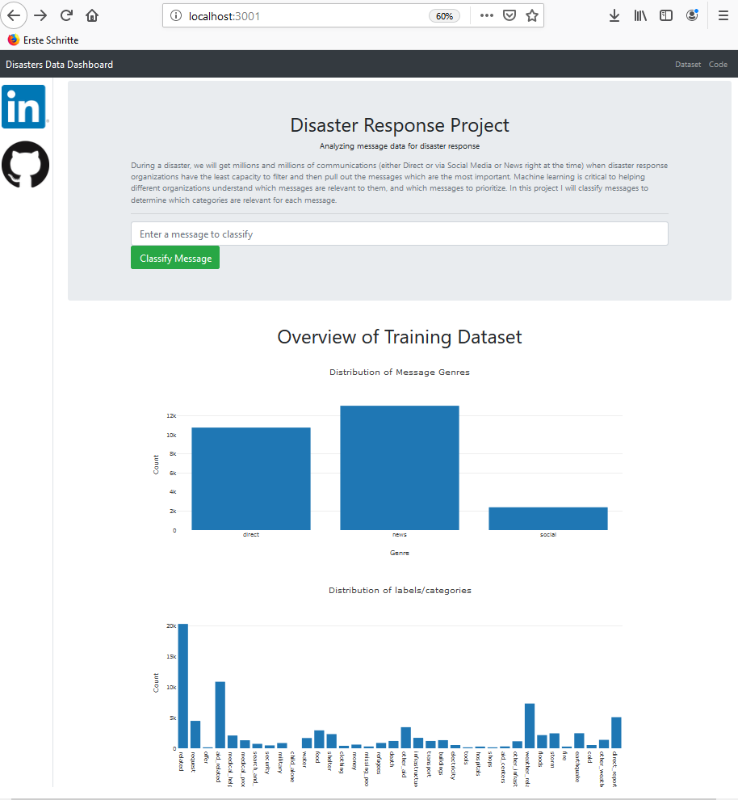
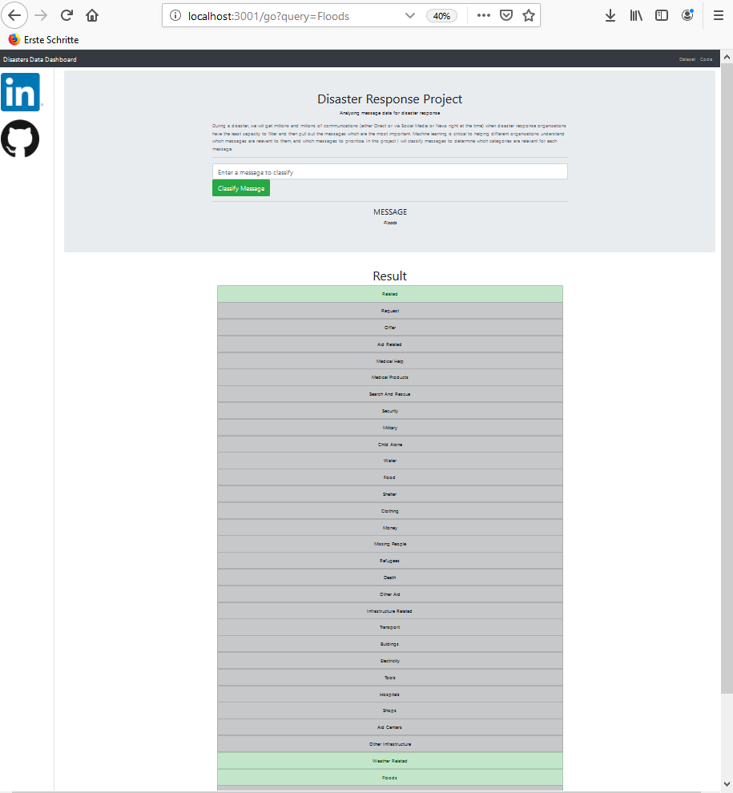

# 1. Introduction

During a disaster, typically we will get millions and millions of communications either direct or via social media right at the time when disaster response organizations have the least capacity to filter and then pull out the messages which are the most important. Machine learning is critical to helping different organizations understand which messages are relevant to them, and which messages to prioritize.  

In this repo, I am going to be analyzing thousands of real messages of disaster data from [Figure Eight](https://appen.com/resources/datasets/), which contains pre-labeled tweets and text messages from real-life disasters, to create a model for an API that classifies disaster messages.

To get a betther understand about creating an ETL Pipeline, NLP Pipelines and  Machine Learning Pipeline go through these repositories respectively:
* 1. [ETL Data Pipelines](https://github.com/A2Amir/ETL-Data-Pipelines)
* 2. [NLP Pipelines](https://github.com/A2Amir/NLP-and-Pipelines)
* 3. [Machine Learning Pipelines](https://github.com/A2Amir/Machine-Learning-Pipelines)

# 2. Prerequisites

To install the flask app, you need:

    python3
    python packages in the requirements.txt file

Install the packages with

    pip install -r requirements.txt
    To create an environment using: conda create --name --file requirements.txt

# 3. Project Components

There are three components for this project: 

1. **ETL Pipeline:** First I will repair the data with [the ETL pipeline](https://github.com/A2Amir/Analyze-Disaster-Data/blob/master/data/ETL%20Pipeline%20Preparation.ipynb) that process messages and category data from CSV file and load them into SQLite database. In the Python script, **[process_data.py](https://github.com/A2Amir/Analyze-Disaster-Data/blob/master/data/process_data.py)**, you will find the data cleaning pipeline that:

    * Loads the messages and categories datasets
    * Merges the two datasets
    * Cleans the data
    * Stores it in a SQLite database

 
 2. **ML Pipeline:** Use [the machine learning pipeline](https://github.com/A2Amir/Analyze-Disaster-Data/blob/master/models/ML%20Pipeline%20Preparation.ipynb) to raed data from the SQLite database to create and save a multi-output supervised learning model. In the Python script, **[train_classifier.py](https://github.com/A2Amir/Analyze-Disaster-Data/blob/master/models/train_classifier.py)**, you will find the machine learning pipeline that:

    * Loads data from the SQLite database
    * Splits the dataset into training and test sets
    * Builds a text processing and machine learning pipeline
    * Trains and tunes a model using GridSearchCV
    * Outputs results on the test set
    * Exports the final model as a pickle file

3. **Flask Web App:** I will create a web application, which use the trained model(the pickle file) to classify incoming messages where an emergency worker can input a new message and get classification results in several categories.

# 4. Structure 
Below you can find the file structure of the project:
<pre><code class="lang-txt">

      - disaster_app
      | - template
      | |- master.html  # main page of web app
      | |- go.html  # classification result page of web app
      | - static
      | |- imgs
      | | |- githublogo.png 
      | | |- linkedinlogo.png 
      |- __init__.py  # Intial Flask file that runs app
      |- routes.py # Flask route file

      - data
      |- disaster_categories.csv  # data to process 
      |- disaster_messages.csv  # data to process
      |- process_data.py
      |- ETL Pipeline Preparation.ipynb (details about crating the ETL Pipeline)
      |- Database.db   # database 
      
      - models
      |- train_classifier.py
      |- utils.py 
      |- ML Pipeline Preparation.ipynb (details about crating the ML Pipeline)
      |- model.pkl  # (The size of the trained model is large, so I could not load it on Github) saved model 
      
      - README.md
      - app.py 
      
</code></pre>

# 5. Instructions for running the Python scripts

Run the following commands in the root directory of each file to set up your database and model

  * To run ETL pipeline that cleans data and stores in database: 
  
               python process_data.py  --f1 disaster_messages.csv  --f2 disaster_categories.csv  --o Database.db
    
  * To run ML pipeline that trains classifier and saves it: 
  
               python train_classifier.py  --f1 ../data/Database.db
               
  * Run the following command in the app's directory to run your web app: 
  
               python app.py
               go to http://0.0.0.0:3001/
	  
  * To get more information about how to deploy this app to a cloud, go through the **Deploy the web app to the cloud** step in [this repository](https://github.com/A2Amir/COVID-19-Data-Dashboard).
         
 

# 6. The screenshots of the web app.

<table align="center">
	<tr>
	    <td align="center" width="9999">
		
	   </td>
           <td align="center" width="9999">
		
	   </td>
        </tr>
</table>       
